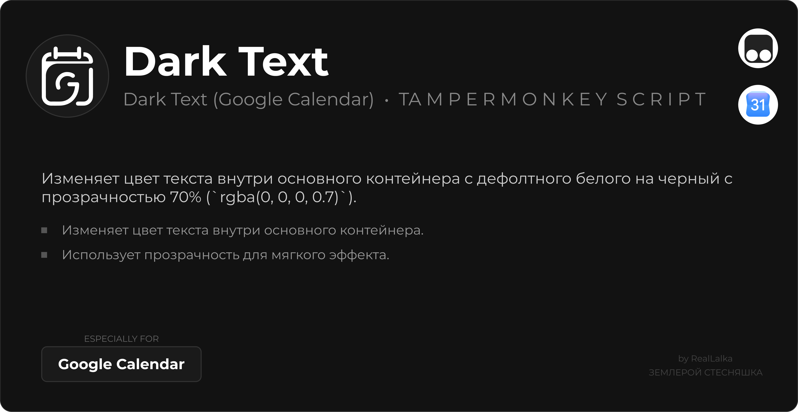

  

  

  <b>Выбор языка / Language:</b> 
  <a href="#-dark-text-google-calendar">🇷🇺 Русский</a> • <a href="#-dark-text-google-calendar-1">🇪🇳 English</a>

---

# 🇷🇺 Dark Text (Google Calendar)
Скрипт для Tampermonkey, который делает текст событий в Google Calendar черным для лучшей читаемости.

## Описание
Изменяет цвет текста внутри основного контейнера с дефолтного белого на черный с прозрачностью 70% (`rgba(0, 0, 0, 0.7)`).

## Установка
1. Установите расширение **Tampermonkey** в ваш браузер.
2. Нажмите на кнопку установки выше или перейдите по [прямой ссылке](https://raw.githubusercontent.com/RealLalka/Dark-Text-Google-Calendar/main/Dark%20Text%20(Google%20Calendar).user.js).
3. Нажмите кнопку **«Установить»** в открывшемся окне Tampermonkey.
4. Сохраните и обновите страницу Google Calendar.

~

# 🇪🇳 Dark Text (Google Calendar)
A Tampermonkey script that makes Google Calendar event text black for better readability.

## Description
Changes the text color inside the main container from the default white to black with 70% opacity (`rgba(0, 0, 0, 0.7)`).

## Installation
1. Install the **Tampermonkey** extension in your browser.
2. Click the install button above or use this [direct link](https://raw.githubusercontent.com/RealLalka/Dark-Text-Google-Calendar/main/Dark%20Text%20(Google%20Calendar).user.js).
3. Click the **"Install"** button in the opened Tampermonkey tab.
4. Save and refresh the Google Calendar page.

